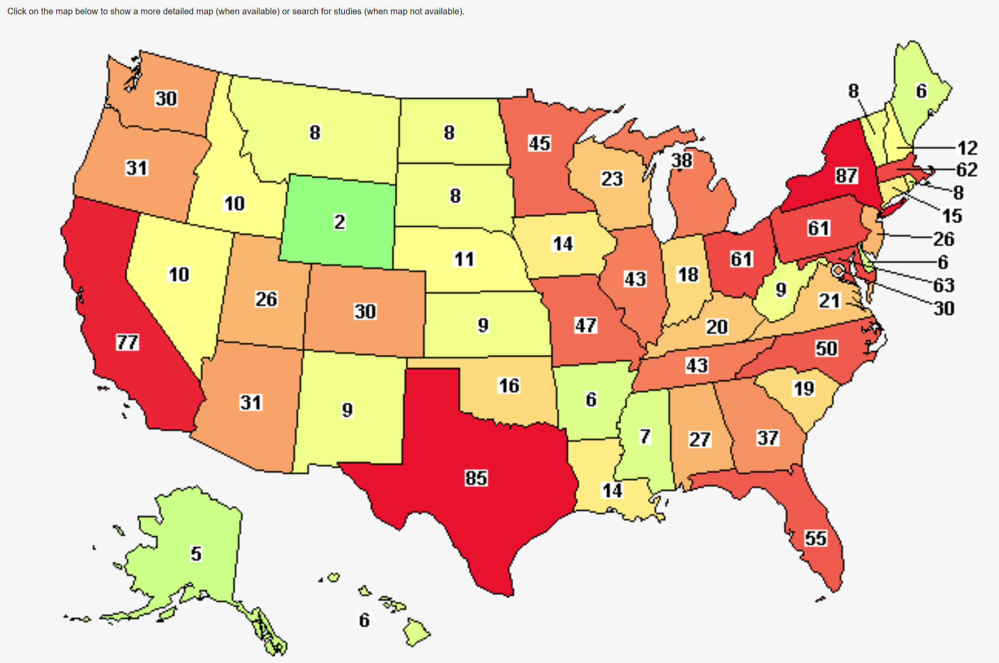

# Research into Brain Cancer Research Funding
## About Brain Cancer

Brain cancer is one of the deadliest cancers in the world. Within five years of diagnosis, 3 out of every 4 patients will die. Some brain cancers, like glioblastoma multiforme, have a median survival rate of one to two years, even with aggressive chemotherapy and radiation.

In 2018 an estimated 77,670 cases of brain tumors will be diagnosed. Approximately 5,000 children younger than 20 will be diagnosed. Brain cancer is the number two cause of cancer deaths in children.

## About 3000 Miles to a Cure

**3000 Miles to a Cure** is a 501(c)(3) non-profit that believes that it is possible to change the future for people diagnosed with brain cancer.  Currently, there are a very limited number of treatments approved by the FDA for use in treating brain tumors.  

It is possible, with proper funding, to change the outcome for those diagnosed with brain cancer. Susan G. Komen and Team in Training have changed the odds for those with Breast Cancer and Leukemia/Lymphoma. HIV was transformed from a diagnosis of certain death to a chronic disease allowing for a full life. The goal of **3000 Miles to a Cure**  is to see the same thing occur for brain cancer by raising money to sponsor brain cancer research.  

To learn more about their mission
[3000 Miles to a Cure](https://3000milestoacure.com/about/)

## Purpose for this Research

**3000 Miles to a Cure** is exploring new opportunities for research investments.  The organization is interested in funding new and innovative areas where their fundraising dollars may have the greatest effect.  This paper describes some potential opportunities that the organization may want to explore as part of a comprehensive and fiscally responsible investment strategy.    

## Clinical Trials by Area
The US National Library of Medicine maintains a list of clinical trials for all types of illnesses.  You can filter the studies by type of illness, area of research, and other interesting aspects of the studies.  

The map below shows each state in the US that are sponsoring clinical trials related to brain cancer research.  This list is filtered to those trials that are in an active state and recruiting patients.  There are 631 available studies.  The map can be explored interactively at [this link](https://clinicaltrials.gov/ct2/results/map?cond=&term=brain+cancer&cntry=&state=&city=&dist=&map=NA%3AUS&recrs=a&recrs=f).    

There are several studies in this list that might be of particular interest:
- [Ketogenic Diet in Children With Malignant or Recurrent/Refractory Brain Tumor.](https://clinicaltrials.gov/ct2/show/NCT03328858?term=brain+cancer&recrs=abdf&draw=2&rank=7)
- 

## References ##
Davis, C. Stoppler, M. (2019, Nov 23). Brain Cancer. Retrieved from emedicinehealth. [What are the various types and grades of brain cancer.](https://www.emedicinehealth.com/brain_cancer/article_em.htm#what_are_the_various_types_and_grades_of_brain_cancer)

US National Library of Medicine Clinical Trials Registry. Study start date: 2017, Nov, 1. Ketogenic Diet in Children With Malignant or Recurrent/Refractory Brain Tumor. Retrieved from [Ketogenic Diet in Children With Malignant or Recurrent/Refractory Brain Tumor.](https://clinicaltrials.gov/ct2/show/NCT03328858?term=brain+cancer&recrs=abdf&draw=2&rank=7)

