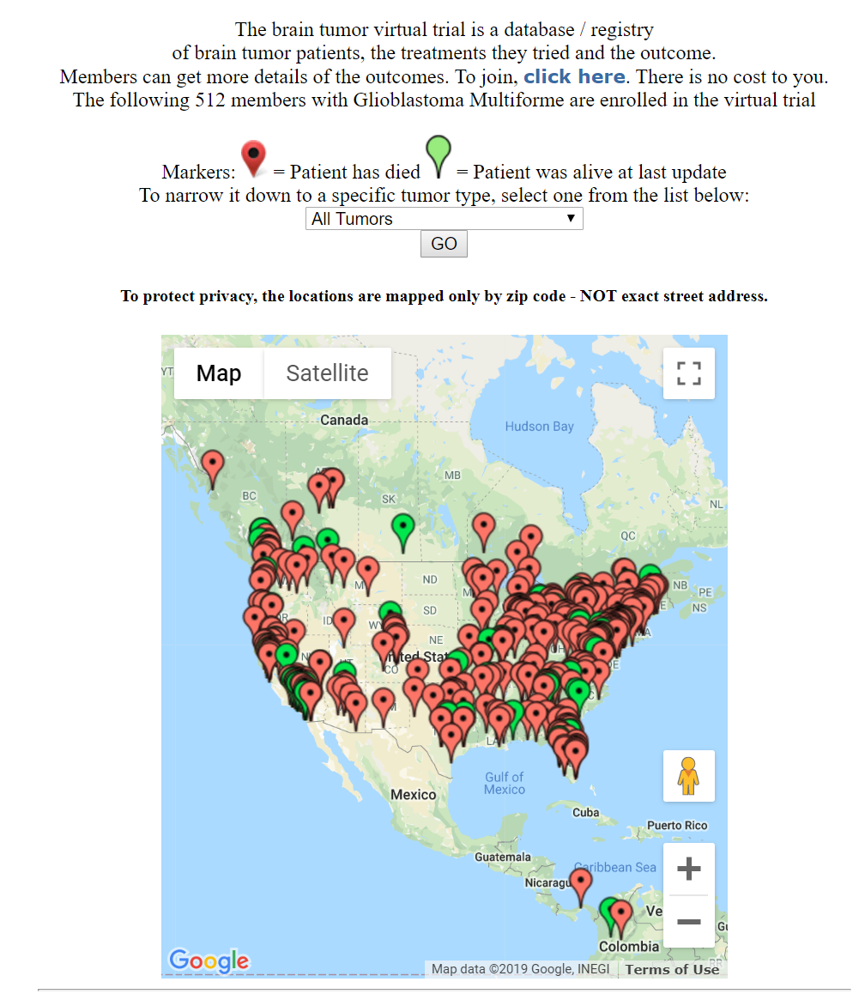

# Research into Brain Cancer Research Funding
## About Brain Cancer

Brain cancer is one of the deadliest cancers in the world. Within five years of diagnosis, 3 out of every 4 patients will die. Some brain cancers, like glioblastoma multiforme, have a median survival rate of one to two years, even with aggressive chemotherapy and radiation.

In 2018 an estimated 77,670 cases of brain tumors will be diagnosed. Approximately 5,000 children younger than 20 will be diagnosed. Brain cancer is the number two cause of cancer deaths in children.

## Purpose for this Research

The non-profit organization **3000 Miles to a Cure** is exploring new opportunities for investing research dollars.  The organization is interested in funding innovative areas where their fundraising dollars may have the greatest impact.  This paper describes some potential opportunities that the organization may want to explore.     

## The Important Role of Private Funding

One challenge with brain cancer research funding in the US is that less than 10% of proposed grants are accepted and funded with federal dollars.  In addition, to be eligible to apply for grants, an organization must first collect initial research data to show project viability. Private philanthropy therefore is important in order to support startup research to make subsequent government funding possible. (Rockey, 2015) 

## Opportunity for Investing in Foundations that Support Clinical Trials 
 One funding opportunity is to support organizations that fund clinical trials. A clinical trial is a research program conducted with patients to evaluate a new medical treatment. The purpose of clinical trials is to find new and improved methods of treating, preventing, screening for, and diagnosing different diseases. 

In cancer research, much of the money used in clinical trials is funded by the National Cancer Institute.  Other sources of funding include non-profit foundations.  **3000 Miles to a Cure** could consider donating to one of these organizations.  

The US National Library of Medicine maintains a list of active clinical trials and their associated funding sources.  The map below shows each state in the US that are sponsoring active clinical trials related to brain cancer research.  There are 631 available studies.  The map can be explored interactively at [this link](https://clinicaltrials.gov/ct2/results/map?cond=&term=brain+cancer&cntry=&state=&city=&dist=&map=NA%3AUS&recrs=a&recrs=f).    

These active trials are vetted by medical experts, and so would constitute good donation targets.  I filtered this list to those that have some non-government funding, in order to explore the organizations that are involved.  All of these organizations accept charitable donations, and note on their website that they would work with  donors to target research dollars to specific areas of donor interest.  

- [Pediatric Brain Tumor Foundation](http://www.curethekids.org/)  
  *   Founded in 1991, they state that they are one of the worlds largest non-governmental sources of funding for childhood brain tumor research 
  * [Charity Navigator site](https://www.charitynavigator.org/index.cfm?bay=search.summary&orgid=8067) - Score - Good - 89.05/100 
  *  Revenue in 2018 approximately $10M
- St Jude Children's Research Hospital
- The Sidney Kimmel Comprehensive Cancer Center at Johns Hopkins University
- St Baldrick's Foundation, which is another large funder of childhood cancer research.  
- [National Pediatric Cancer Foundation](https://nationalpcf.org/) 
  * Revenue raised $23M

There are several studies in this list that looked to be of particular interest to **3000 Miles to a Cure**:
- [Ketogenic Diet in Children With Malignant or Recurrent/Refractory Brain Tumor.](https://clinicaltrials.gov/ct2/show/NCT03328858?term=brain+cancer&recrs=abdf&draw=2&rank=7)

## Other Opportunities for Donations

There are some smaller foundations that I found that also provide funding for brain cancer research.  These organizations are not large enough to be vetted by Charity Navigator.  However, they look to be providing valuable research dollars towards brain cancer, and they are all non-profits.  Here is the list of these organizations. 

- [The Broach Foundation](https://www.thebroachfoundation.org/) a 501(c)(3) non-profit, $5 million to date 
  * This organization was founded by a father who died in 2013 of brain cancer.  Their mission is to promote funding for brain cancer research and education.  All proceeds that they raise are provided as grants to qualified research clinicians. 
  *  Their current grant recipient is Dr. Fredrick Lang, the Director of Clinical Research in the Department of Neurosurgery in the Brain Tumor Center at The University of Texas MD Anderson Cancer Center.  This group has pioneered a number of novel discoveries in the use of biological agents to target brain cancer cells.  

- [Musella Foundation](https://virtualtrials.com/musella.cfm) a 501(c)(3) non-profit, $5M to date
  * This organization started in 1993 as a support group for brain cancer patients.  The founder has lost several family members to the disease.  They now provide grant funding for researchers, and they are advocates at the FDA and for insurance funding of drugs such as Avastin, Temodar, and Gliadel.  There is an interesting article about them at this link [The remarkable story
of Virtualtrials.com](https://virtualtrials.com/pdf/vt.pdf). 
  *  I like their approach, they fund smaller research projects that show promise, and they collect data provided voluntarily by patients, the treatments they tried, and their outcome.  This data is shared.  It could help identify patterns hidden in the data.  Below is an image showing the information they collect, and [here is the direct link](https://virtualtrials.com/vtmap8.cfm).

## References ##
Davis, C. Stoppler, M. (2019, Nov 23). Brain Cancer. Retrieved from emedicinehealth. [What are the various types and grades of brain cancer.](https://www.emedicinehealth.com/brain_cancer/article_em.htm#what_are_the_various_types_and_grades_of_brain_cancer)

Rockey, S. (2015, June 29). What are the Chances of Getting Funded?.  Retrieved from: [Nexus](https://nexus.od.nih.gov/all/2015/06/29/what-are-the-chances-of-getting-funded/)

US National Library of Medicine Clinical Trials Registry. Study start date: 2017, Nov, 1. Ketogenic Diet in Children With Malignant or Recurrent/Refractory Brain Tumor. Retrieved from [Ketogenic Diet in Children With Malignant or Recurrent/Refractory Brain Tumor.](https://clinicaltrials.gov/ct2/show/NCT03328858?term=brain+cancer&recrs=abdf&draw=2&rank=7)
